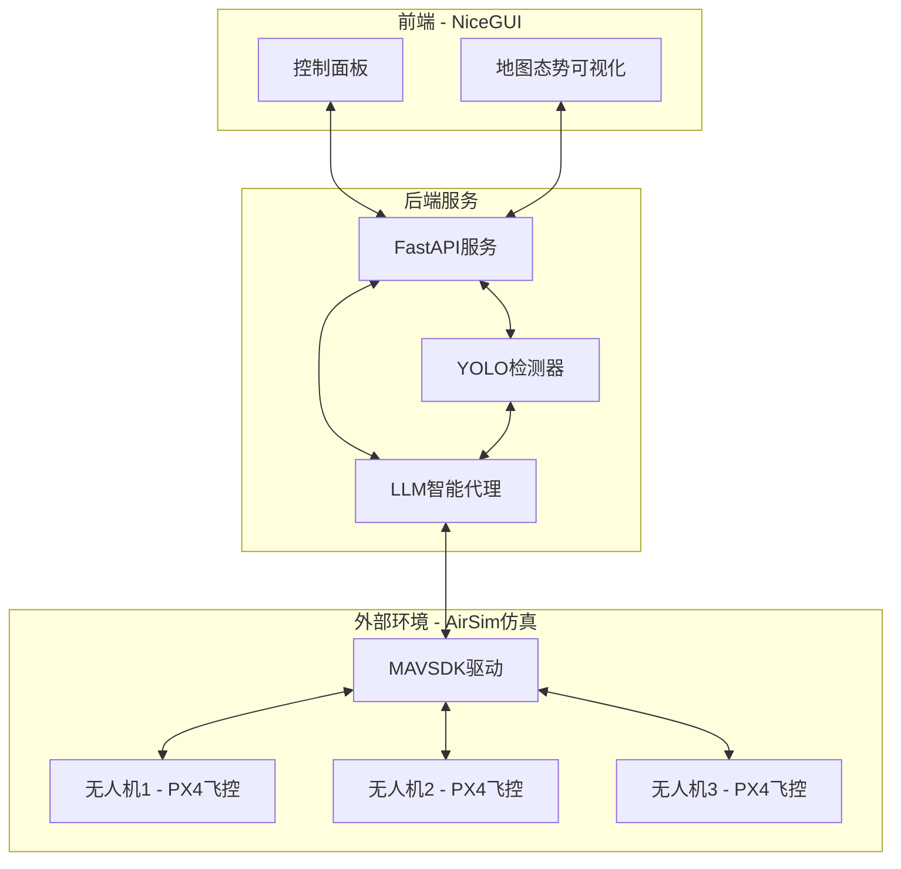
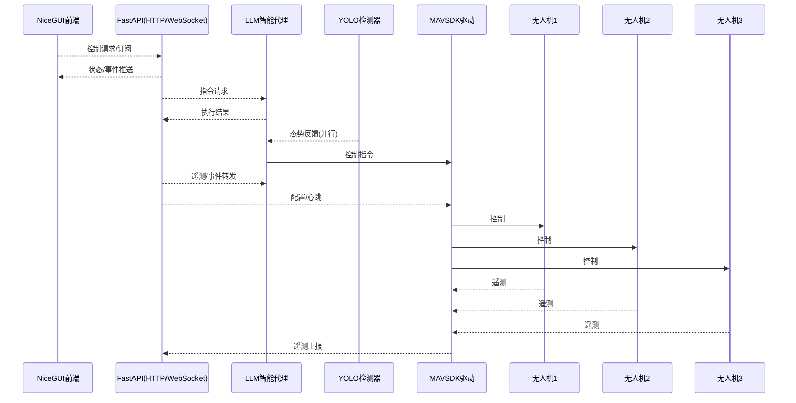

# LLM-Airsim 架构设计文档 V0.1

## 1. 项目概述

### 1.1 系统简介
LLM-Airsim 是一个基于 Python 的无人机控制系统，采用前后端分离架构，集成了 LLM 智能决策、实时地图可视化、多机编队控制等功能。

### 1.2 技术栈
- **后端**: FastAPI + MAVSDK + LLM API
- **前端**: NiceGUI + Leaflet + JavaScript Bridge
- **通信**: WebSocket + RESTful API
- **AI**: OpenAI 兼容 API + YOLO 目标检测

## 2. 系统架构设计

### 2.1 整体架构图



### 2.2 目录结构

```
LLM-Airsim/
├── main.py                 # 主程序入口
├── config.yaml            # 全局配置
├── app/                   # 后端服务
│   ├── main.py           # FastAPI应用
│   ├── api/              # API接口
│   │   ├── v1/          # API版本1
│   │   └── dependencies.py
│   ├── core/             # 核心业务
│   │   ├── agent.py     # LLM智能代理
│   │   ├── config.py    # 配置管理
│   │   ├── yolo_detector.py # 目标检测
│   ├── drone/            # 无人机控制
│   ├── simulation/       # 仿真接口
│   ├── middleware/       # 中间件
│   ├── schemas/          # 数据模型
│   └── utils/            # 工具函数
├── app_ui/               # 前端界面
│   ├── main_page.py     # 主页面
│   ├── map.py           # 地图组件
│   ├── marker.py        # 标记管理
│   ├── styles.py        # 样式系统
│   ├── drone_connection.py # 连接面板
│   ├── static/          # 静态资源
│   │   ├── marker.js    # 地图标记JS
│   │   ├── drone.svg    # 无人机图标
│   │   └── person.svg   # 人员图标
│   └── tests/           # 前端测试
└── tests/               # 后端测试
```

## 3. 核心模块设计

### 3.1 无人机控制模块

#### 功能特性
- **多机支持**: 支持单机和多机编队控制
- **实时通信**: 基于 MAVSDK 的实时状态监控
- **任务执行**: 支持航点任务、跟随任务、编队飞行等
- **安全保护**: 紧急降落、返航、碰撞避免等安全机制
- **编队控制**: 支持三角形、直线、圆形等编队模式
- **仿真环境**: 基于 AirSim 的仿真环境支持

#### 配置示例
```yaml
drones:
  drone1:
    connection_string: "udpin://0.0.0.0:14540"
    name: "Alpha"
    role: "leader"
    enabled: true
    
  drone2:
    connection_string: "udpin://0.0.0.0:14541"
    name: "Beta"
    role: "follower"
    enabled: true
    
  drone3:
    connection_string: "udpin://0.0.0.0:14542"
    name: "Gamma"
    role: "follower"
    enabled: true
```

### 3.2 LLM 智能代理模块

#### 功能特性
- **任务执行**: 负责任务规划和指令生成
- **智能决策**: 基于 LLM 的任务分解和决策
- **上下文理解**: 支持多轮对话和上下文记忆
- **API 兼容**: 支持 OpenAI 兼容的 API 服务
- **态势分析**: 接收YOLO检测结果进行态势分析

#### 核心接口
```python
class LLMAgent:
    async def process_command(self, command: str) -> str
    async def plan_mission(self, objectives: List[str]) -> Mission
    async def analyze_situation(self, context: Dict) -> Analysis
    async def generate_execution_plan(self, task: str, constraints: Dict) -> ExecutionPlan
```

### 3.3 地图可视化模块

#### 技术架构
- **前端框架**: NiceGUI + Leaflet
- **JavaScript Bridge**: Python 与 JavaScript 双向通信
- **实时更新**: WebSocket 实时数据推送
- **样式定制**: CSS + SVG 图标系统

#### 核心组件
```python
class MarkerManager:
    def create_drone(self, lat: float, lng: float, heading: float)
    def move_to(self, lat: float, lng: float, heading: float)
    def set_class(self, class_name: str)
```

### 3.4 目标检测模块

#### 功能特性
- **态势感知**: 负责环境感知和态势信息收集
- **实时检测**: 基于 YOLO 的实时目标检测
- **多目标识别**: 支持人员、车辆、障碍物等
- **坐标转换**: 图像坐标到地理坐标的转换
- **态势反馈**: 将检测结果反馈给LLM智能代理
- **并行处理**: 与任务执行并行运行，提供实时态势信息

#### 核心接口
```python
class YOLODetector:
    async def detect_objects(self, image: np.ndarray) -> List[Detection]
    async def analyze_situation(self, detections: List[Detection]) -> SituationReport
    async def get_environment_context(self) -> EnvironmentContext
```

## 4. 数据流设计

### 4.1 实时数据流




## 5. 接口设计（并非接口文档！仅做初期设计提示用）

### 5.1 RESTful API

#### 5.1.1 无人机控制接口
```python
# 获取无人机状态
GET /api/v1/drones/{drone_id}/status

# 获取编队状态
GET /api/v1/fleet/status

# 发送控制指令
POST /api/v1/drones/{drone_id}/control
{
    "command": "takeoff",
    "parameters": {"altitude": 10.0}
}

# 编队控制指令
POST /api/v1/fleet/control
{
    "command": "formation",
    "formation_type": "triangle",
    "leader_id": "drone1",
    "parameters": {
        "spacing": 10.0,
        "altitude": 15.0
    }
}

# 执行任务
POST /api/v1/drones/{drone_id}/mission
{
    "waypoints": [...],
    "type": "patrol"
}

# 编队任务
POST /api/v1/fleet/mission
{
    "formation": "triangle",
    "waypoints": [...],
    "type": "patrol"
}

# MAVSDK指令
POST /api/v1/mavsdk/command
{
    "drone_id": "drone1",
    "command": "arm",
    "parameters": {}
}
```

#### 5.1.2 LLM 接口
```python
# 任务执行指令
POST /api/v1/llm/execute
{
    "task": "让无人机飞到目标点A",
    "context": {...}
}

# 任务规划
POST /api/v1/llm/plan
{
    "objectives": ["巡逻", "检测"],
    "constraints": {...}
}

# 态势分析
POST /api/v1/llm/analyze_situation
{
    "detection_data": {...},
    "environment_context": {...}
}
```

#### 5.1.3 YOLO 接口
```python
# 目标检测
POST /api/v1/yolo/detect
{
    "image": "base64_encoded_image",
    "detection_config": {...}
}

# 态势感知
GET /api/v1/yolo/situation
{
    "current_situation": {...},
    "environment_context": {...}
}
```

### 5.2 WebSocket 接口

#### 5.2.1 实时数据推送
```python
# 无人机状态更新
{
    "type": "drone_status",
    "drone_id": "drone1",
    "data": {
        "position": {"lat": 39.9042, "lng": 116.4074},
        "altitude": 10.0,
        "heading": 45.0,
        "battery": 85.0,
        "status": "armed"
    }
}

# 编队状态更新
{
    "type": "fleet_status",
    "data": {
        "formation": "triangle",
        "leader": "drone1",
        "drones": [
            {"id": "drone1", "position": {...}, "status": "leader"},
            {"id": "drone2", "position": {...}, "status": "follower"},
            {"id": "drone3", "position": {...}, "status": "follower"}
        ],
        "formation_health": "good"
    }
}

# 态势感知推送
{
    "type": "situation_update",
    "data": {
        "detections": [...],
        "environment_context": {...},
        "timestamp": "2024-01-01T12:00:00Z"
    }
}

# 检测结果推送
{
    "type": "detection_result",
    "drone_id": "drone1",
    "data": {
        "objects": [...],
        "timestamp": "2024-01-01T12:00:00Z"
    }
}
```


### 5.3 日志系统
```python
# 结构化日志
{
    "timestamp": "2024-01-01T12:00:00Z",
    "level": "INFO",
    "module": "drone_controller",
    "message": "无人机起飞成功",
    "drone_id": "drone1",
    "metadata": {...}
}
```


## 6. 总结

LLM-Airsim 采用现代化的微服务架构，通过前后端分离、模块化设计、插件化扩展，实现了高可扩展性、高可维护性的无人机控制系统。系统集成了 AI 智能决策、实时可视化、多机协同等先进功能，为无人机应用提供了完整的解决方案。
