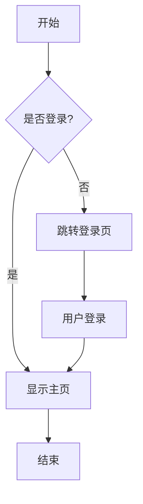

# 测试文档

这是一个测试Markdown文档，用于验证水印功能。

## 功能特点

- 支持中文
- 支持代码高亮
- 支持Mermaid图表

## 代码示例

```python
def hello_world():
    print("Hello, World!")
```

## Mermaid图表



## 总结

这个工具可以很好地将Markdown转换为PDF并添加水印。
