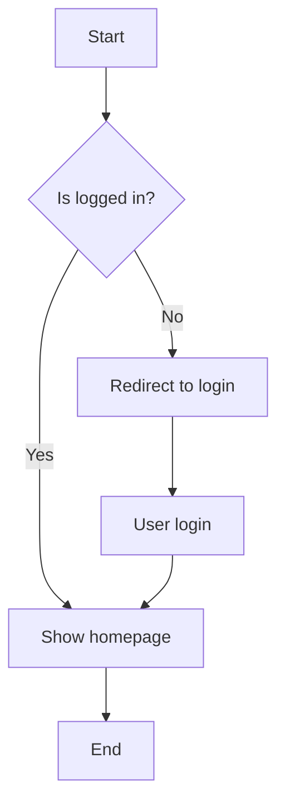

# Test Document

This is a test Markdown document for verifying watermark functionality.

## Features

- Support for English
- Support for code highlighting
- Support for Mermaid diagrams

## Code Example

```python
def hello_world():
    print("Hello, World!")
```

## Mermaid Diagram



## Summary

This tool can effectively convert Markdown to PDF and add watermarks.
